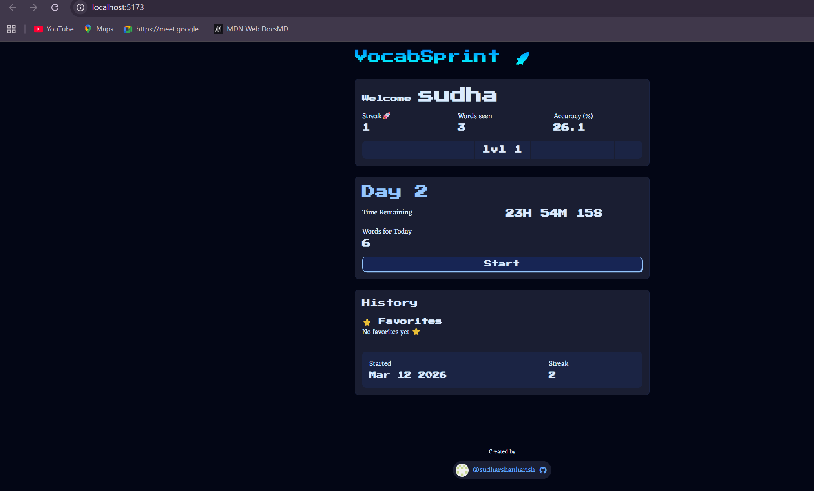
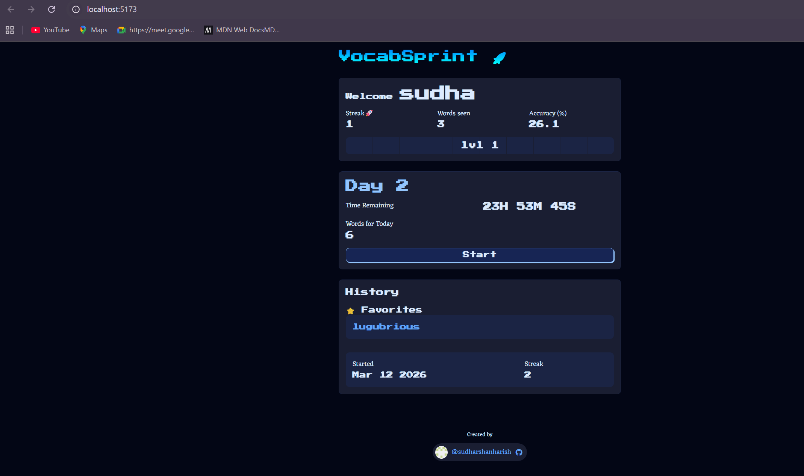
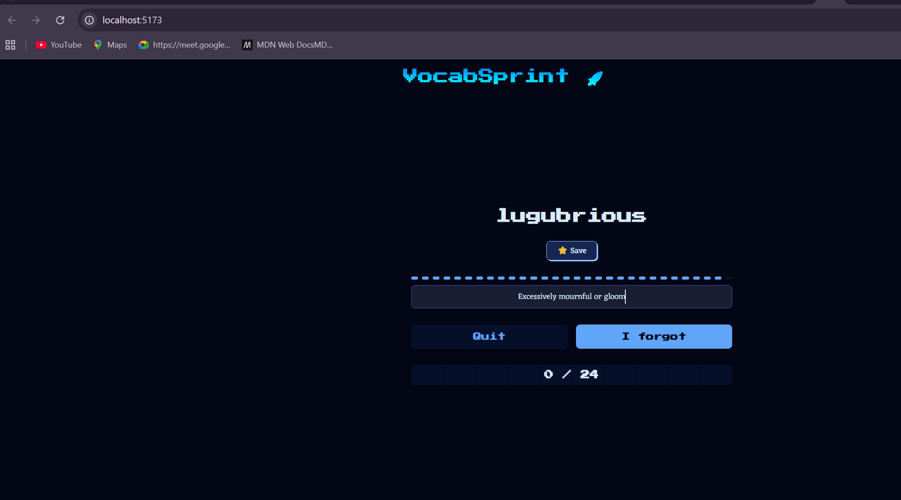

# Word Memory App (React)

A React-based word memory application that helps users practice and retain vocabulary through interactive challenges and repetition.

## Features

* Interactive word challenge system
* Streak and progress tracking
* Accuracy calculation based on attempts
* Save and manage favorite words ⭐
* Click favorite words to revisit them in the challenge
* Persistent storage using localStorage (data remains after refresh)
* Responsive UI for desktop and mobile

## Tech Stack

* React (Functional Components + Hooks)
* JavaScript (ES6+)
* LocalStorage (for persistence)
* CSS (custom styling)

## How It Works

* Users progress through daily word challenges
* Words are repeated to reinforce memory
* Progress such as streak, attempts, and history is tracked
* Favorite words can be saved and revisited later
* All data is stored locally in the browser

## Getting Started

```bash
pnpm install
pnpm dev
```

## Screenshots


* Challenge page with save feature
* Dashboard with favorites and history

### Dashboard Overview


### Dashboard with Favorites


### Revisit Favorite Word


## Improvements (Future Work)

* Implement real spaced repetition algorithm
* Add user authentication
* Sync data across devices (backend integration)
* Improve UI/UX and animations
* Add search and filtering for saved words

